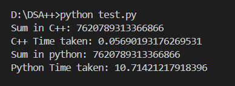

#  DSA++  

> **DSA++** — A high-performance C++ library for Data Structures & Algorithms, fully accessible from **Python** using [PyBind11](https://github.com/pybind/pybind11).  
> Combine **Python’s simplicity** with **C++ execution speed**, achieving up to **5–6× faster performance** on heavy tasks.  
---


---

## Table of Contents
- [Overview](#-overview)
- [Folder Structure](#-folder-structure)
- [Build Instructions](#️-build-instructions)
- [Usage Examples](#-usage-examples)
- [Performance Benchmark](#-performance-benchmark)
- [Core Components](#-core-components)
- [Tech Stack](#-tech-stack)
- [Author](#-author)
- [License](#-license)

---

## Overview

**DSA++** was built to explore how libraries like **NumPy** and **PyTorch** connect Python with C++ for extreme performance.

It implements core **data structures and algorithms** in C++ using STL, then exposes them to Python through **PyBind11 bindings**, automatically producing a compiled `.pyd` for windows(very similar to Dynamic Link Library) or .so file in linux/mac module you can import just like a normal Python library.

```python
from dsapp import HashMap, Stack, Queue, quick_sort 
```

## Folder Structure
DSA++/
│
├── build/
│ ├── lib.win-amd64-3.10/
│ └── temp.win-amd64-3.10/
│
├── include/
│ └── dsapp.h # All class & function declarations
│
├── src/
│ ├── bindings.cpp # PyBind11 module definitions
│ ├── HashMap.cpp
│ ├── Queue.cpp
│ ├── Stack.cpp
│ ├── Sort.cpp
│ └── dsapp.cp310-win_amd64.pyd # Compiled binary importable in Python
│
├── sum_module.cpp/.pyd # Example: Python vs C++ sum speed test
├── test.py # Benchmark script
├── setup.py # Build script
├── sample.exe # Standalone C++ test
└── README.md


## Build Instructions

### Prerequisites

- **C++17 or newer**
- **Python 3.10+**
- **PyBind11**

Install PyBind11:
```bash
pip install pybind11
```
Build the module
From the project root:

```bash
python setup.py build_ext --inplace
```
This creates:
dsapp.cp310-win_amd64.pyd


Now you can directly import it in Python:

```python 
from dsapp import Stack, Queue, HashMap, quick_sort
from dsapp import Stack

s = Stack()
s.push(10)
s.push(20)
print(s.top())   
s.pop()
print(s.top())   


m = HashMap()
m.put("x", 42)
print(m.get("x"))          # 42
print(m.contains("x"))     # True
print(m.keys())            # ['x']

q = Queue()
q.push(5)
q.push(10)
print(q.front())   # 5

arr = [5, 3, 9, 1]
quick_sort(arr)
print(arr)         # [1, 3, 5, 9]
```

## Performance Benchmark 

 See test.py 

```python 
# built to benchmark sum of n number in C++ vs python

import sum_module
import dsapp
import time

def sum(n):
    sum =0
    for i in range(n):
        sum += i
    return sum


start = time.time()
print("Sum in C++:", sum_module.compute_sum(123456789))
end = time.time()
print("C++ Time taken:", end - start)

start = time.time()
print("Sum in python:", sum(123456789)) 
end = time.time()
print("Python Time taken:", end - start)    
```



**This c++ peforms 200x faster than python but in average it performs 5-6x faster than python**